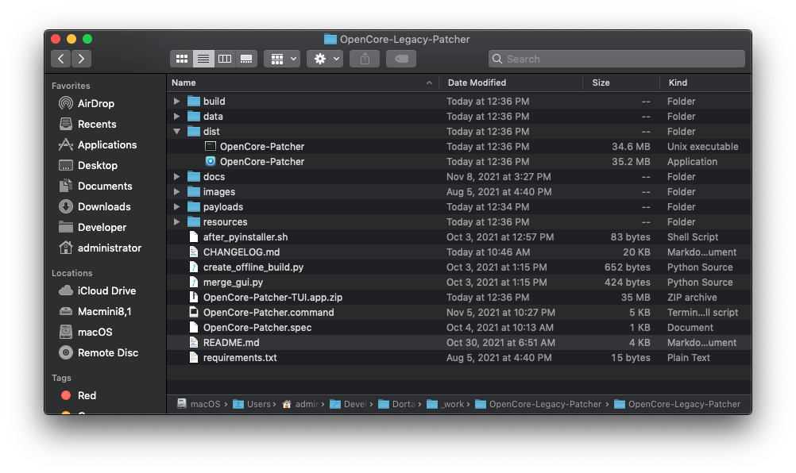

# Build and run from source

OpenCore Legacy Patcher at its core is a Python-based GUI/CLI-based application. In turn, to run the project from source, you simply need to invoke the OpenCore-Patcher-GUI.command file via Python.

For developers wishing to validate mainline changes, you may use this link: [GUI (Graphical Based App)](https://nightly.link/dortania/OpenCore-Legacy-Patcher/workflows/build-app-wxpython/main/OpenCore-Patcher.app%20%28GUI%29.zip)

* **Warning**: Nightly builds (untagged builds built from the latest commit) are actively developed OpenCore Legacy Patcher builds. These builds have not been tested, are not guaranteed to work, and are not guaranteed to be safe. Do not use nightlies without a good reason to do so, and do not use them on your main machine. Additionally, these binaries should not be used without first consulting the [CHANGELOG](./CHANGELOG.md).

  **Do not share _any_ links to these binaries** in forums; please link to **this document only**.
  * Additionally, do not reupload these binaries or download binaries from other sites. Using binaries from untrusted sources is a security issue, as they may have been tampered with.
* Users running new builds of the project without understanding what has changed and the implications of installing software under active development are at a higher risk of bricking their installation as they do not read any warnings provided in the CHANGELOG. We wish to minimize these situations as much as possible.

## Getting Started

To start, ensure you have Python 3.6 or newer installed. Additionally, ensure that it was downloaded from the official source, [python.org](https://www.python.org/downloads/macos/).

* Python installations either preinstalled or provided with Xcode or the Xcode Command Line Tools are unsupported due to reliability issues.

Once Python is installed, open Terminal and run the following:

```sh
# Move into a directory to store the project
cd ~/Developer
# Clone project
git clone https://github.com/dortania/OpenCore-Legacy-Patcher
# Move into Project directory
cd ./OpenCore-Legacy-Patcher
# Install Python dependencies used by the project
pip3 install -r requirements.txt
```

If you have any installation errors, see the following troubleshooting options:

* Use Python 3.10
  * Our build server currently uses Python 3.10 for generating binaries used in releases
* Use .whl snapshots for installing additional dependencies

## Running OpenCore Legacy Patcher

To run the project from source, simply invoke via python3:

```sh
# Launch GUI
python3 OpenCore-Patcher-GUI.command
```

Note that the OpenCore-Patcher-GUI.command file can be run as both a GUI and a CLI utility for other programs to call. If no core arguments are passed, the GUI is initialized. Otherwise the CLI will start:

```sh
# Launch CLI
python3 OpenCore-Patcher-GUI.command --build --model iMac12,2 --verbose
```

Pass `-h` or `--help` for more information on supported CLI arguments.

## Generating prebuilt binaries

The main goal of generating prebuilt binaries is to strip the requirement of a local Python installation for users. For developers, there's very little benefit besides enabling dark mode support in the GUI. For development, simply use the OpenCore-Patcher-GUI.command file with a Python 3 installation.

```sh
# Install PyInstaller
pip3 install pyinstaller
# Move into project directory
cd ~/Developer/OpenCore-Legacy-Patcher/
# Create the pyinstaller based Application
python3 Build-Project.command
# Open build folder
open ./dist/
```

Once done, you'll find the application generated at `./dist/OpenCore-Patcher.app`:


